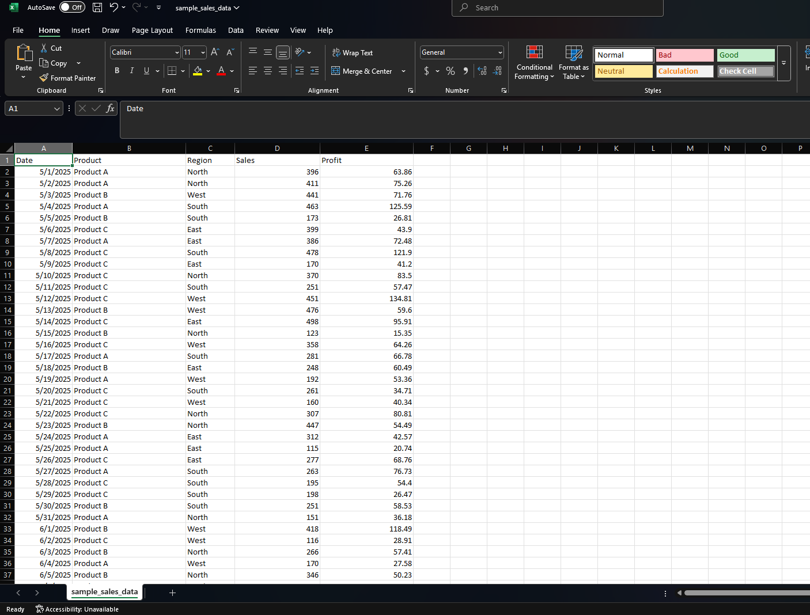

# 📊 Sales Dashboard

This is a simple sales dashboard for tracking and visualizing business sales data.  
It shows key metrics like total revenue, top-selling products, and monthly sales trends, helping you monitor sales performance easily.

## 🚀 Features

- 📈 Total sales and revenue summary
- 🏆 Top-selling products
- 📊 Monthly sales trends with charts
- 📂 Organized file structure for easy access
- 🔍 Clean and easy-to-understand layout

## 🛠️ Tools & Technologies Used

- **Excel** – for creating the dashboard and charts

## 📂 Folder Structure

## 🖥️ Screenshot

Here’s a preview of the Sales Dashboard:

## ▶️ How to Use

1. Download or clone this repository.
2. Open the Excel file inside the `/dashboard/` folder.
3. Update the sales data in the `/data/` folder as needed.
4. Refresh the dashboard sheet to see the updated charts and metrics.

